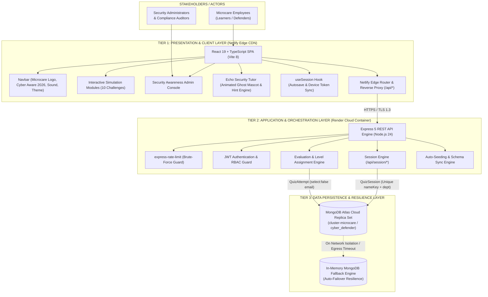

# Technical Architecture & Engineering Build Report
## Microcare Cyber Aware 2026 — Cybersecurity Awareness Platform
**Official Platform Slogan:** *“You are the Firewall”*

---

### Document Information
- **Project Name:** Microcare Cyber Aware 2026 (formerly Cyber Defender)
- **Official Branding:** **Cyber Aware 2026**
- **Author:** Engineering Team / Full-Stack Technical Lead
- **Target Audience:** Technical Leadership, Engineering Management & Security Architects
- **System Version:** 2.1.0 (Production Release — Session Resumption, Privacy Guard & Adaptive Echo Engine)
- **Primary Repository:** `cybesecurity-awareness-quizz` (`Cyber-Defender-Awareness-Platform`)
- **Frontend URL:** Netlify Edge CDN Deployment
- **Backend API URL:** `https://cyber-aware-api.onrender.com`
- **Database Engine:** MongoDB Atlas Cloud Cluster (`cluster-microcare.gepmhm7.mongodb.net`)
- **Document Date:** October 2026

---

## 1. Executive Summary & Purpose

The **Microcare Cyber Aware 2026** platform is an enterprise-grade, simulation-driven training, evaluation, and session-resilience system engineered to reinforce the human layer of cybersecurity across organizational departments.

Traditional annual cybersecurity training programs rely predominantly on passive multiple-choice questionnaires and video lectures. Industry data demonstrates that passive learning fails to establish behavioral deterrence against sophisticated social engineering threats such as Business Email Compromise (BEC), smishing, MFA fatigue, and quishing (QR code phishing).

**Cyber Aware 2026** replaces passive questionnaires with **ten high-fidelity, interactive simulation scenarios**. Employees actively triage weaponized artifacts—inspecting raw email RFC headers, dragging credentials into entropy buckets, detecting physical office clean-desk vulnerabilities, neutralizing MFA push floods, and orchestrating emergency incident responses in real time.

### Strategic Objectives
1. **Active Behavioral Simulation:** Train employees using muscle memory and tactical decision-making rather than rote memorization.
2. **Resilient Session Lifecycle & Zero Data Loss:** Server-persisted session tracking (`QuizSession`) with per-challenge autosave, cryptographic device tokens, and 8-character cross-device resume codes.
3. **Strict Case-Insensitive Identity & Retake Prevention:** Race-safe database uniqueness per department with intelligent casing normalization; completed participants are permanently locked to their certified records.
4. **Adaptive Contextual Tutoring (Echo):** An interactive, TryHackMe-inspired AI security mentor featuring an animated ghost mascot, internal threat discovery checklist tracking, and progressive zero-spoiler hints.
5. **Zero-Leakage Data Privacy:** Strict separation of authentication and reporting data; work emails are stored with `select: false` and are never exposed in UI views, API payloads, or CSV audit exports.
6. **Enterprise Analytics & Audit Compliance:** Empower security administrators and compliance auditors (ISO/IEC 27001, SOC 2 Type II, HIPAA) with granular department telemetry, active in-progress session monitoring, single-participant session resets, and vulnerability heatmaps.
7. **Full Dual-Theme Inversion:** Contrast-adaptive dark and light modes across all views (Learner UI, Echo Bot, and Admin Console).

---

## 2. High-Level System Architecture

The platform is designed around a modern, decoupled **3-Tier Distributed Architecture** enhanced with a stateful session engine:

1. **Presentation & Simulation Tier (Frontend):** 
   A high-performance Single Page Application (SPA) built using React 19 and TypeScript 6, styled with Tailwind CSS v4, and bundled with Vite 8. Deployed on **Netlify's Global Edge Network**. Includes full dark/light theme switching, sound effects engine, and local session token synchronization (`cyber_defender_session`).
2. **Application & Orchestration Tier (Backend API):**
   A stateless REST API built on Node.js 24 and Express 5 (ECMAScript Module architecture), providing input evaluation, scoring algorithms, session autosave, administrative session management, and rate-limited identity endpoints. Hosted on **Render Cloud**.
3. **Data Persistence & Resilience Tier (Database):**
   A cloud-hosted managed replica set on **MongoDB Atlas** (`cluster-microcare`), featuring compound unique indexes, automated failover, and connection pooling. Includes an autonomous in-memory MongoDB fallback engine (`MongoMemoryServer`) to guarantee zero-downtime execution in restricted environments.



---

## 3. Technology Stack & Technical Justifications

| Layer | Component | Version | Rationale & Architectural Benefit |
| :--- | :--- | :--- | :--- |
| **Frontend Framework** | React | `19.2.8` | Concurrent rendering engine; declarative state hooks; zero memory leaks during rapid scenario transitions. |
| **Type Safety** | TypeScript | `6.0.2` | Comprehensive type contracts for session state (`QuizSessionData`, `SessionResumeResponse`), challenge payloads, and API interfaces. |
| **Build Tooling** | Vite | `8.3.0` | Sub-second Hot Module Replacement (HMR) and optimized Rollup tree-shaking producing minimal production bundles. |
| **Styling & Design** | Tailwind CSS | `4.3.3` | Next-generation engine (`@tailwindcss/vite`); utility-first design system with inverted slate scale for seamless dark & light mode contrast. |
| **Iconography** | Lucide React | `1.49.0` | Tree-shakeable, clean SVGs for security indicators, attack vectors, and terminal consoles. |
| **Vector Animation** | Custom Inline SVG + CSS3 | Hardware Accel. | Zero-dependency CSS keyframe animations for the 3D-floating Echo ghost mascot (`echoFloat3D`, `echoCapeWave`, `echoGlowPulse`). |
| **UX Celebrations** | Canvas Confetti | `1.9.4` | Hardware-accelerated client-side particle canvas for positive psychological reinforcement upon completion. |
| **Backend Runtime** | Node.js | `24.21.0` | Latest LTS engine featuring native fetch, V8 optimizations, and modern ES Module support (`"type": "module"`). |
| **API Framework** | Express | `5.2.1` | Native Promise error propagation, optimized routing algorithms, and robust middleware pipelines. |
| **Rate Limiting** | Express Rate Limit | `7.5.0` | IP-based rate limiting on sensitive `/api/session/start` and `/api/session/resume` endpoints to block name enumeration. |
| **Database ODM** | Mongoose | `9.10.3` | Compound unique indexing, `select: false` privacy enforcement, schema validation, and aggregation pipelines. |
| **Database Driver** | MongoDB Native Driver | `6.14.0` | Low-latency binary wire protocol connection with replica set management. |
| **Resilience Engine** | MongoMemoryServer | `11.3.0` | Ephemeral in-memory database fallback to ensure system operability even if cloud network partitions occur. |
| **Security & Auth** | JSON Web Tokens (`jsonwebtoken`) | `9.0.3` | Cryptographically signed, stateless Bearer tokens (HS256) for administrator endpoints with 8-hour TTL. |
| **Password Hashing** | Bcrypt.js | `3.0.3` | Salted one-way hashing with cost factor 10 to protect administrative credentials against rainbow table attacks. |
| **Crypto Utilities** | Node.js Native `crypto` | Built-in | Cryptographic 256-bit device token generation, SHA-256 token hashing, and unambiguous 8-char resume codes. |
| **Edge CDN** | Netlify | Edge Network | Global HTTP/3 CDN with zero-latency edge distribution and transparent API reverse proxying (`/api/*`). |
| **Cloud Computing** | Render | Docker/Container | Zero-configuration continuous deployment linked to Git VCS with automatic health checking and port binding. |
| **Cloud Database** | MongoDB Atlas | AWS us-east | Multi-AZ replica set with automated backups, monitoring, and IP-based access control lists (0.0.0.0/0 egress allowance). |

---

## 4. Platform Data Collection & Storage Specification

### 4.1 Data Collected from the User (Input Layer)

The platform intentionally minimizes data collection to protect employee privacy while ensuring test integrity:

| Field Name | Collection Screen | Mandatory? | Validation Rules & Constraints | Purpose & Handling |
| :--- | :--- | :--- | :--- | :--- |
| **Full Name** (`name`) | Welcome Screen Registration | **Yes** (`*`) | 2–60 chars, Unicode letters (`\p{L}`), spaces, dots, apostrophes, hyphens. | Identifies participant. Normalized to `nameKey` for uniqueness; original casing preserved for display. |
| **Department** (`department`) | Welcome Screen Registration | **Yes** (`*`) | Must match 1 of 9 canonical departments from `DEPARTMENTS`. | Organizes training metrics; scopes name uniqueness per department. |
| **Work Email** (`email`) | Welcome Screen Registration | **No** (Optional) | Max 254 chars, RFC-compliant format (`[^\s@]+@[^\s@]+\.[^\s@]+`). | **Session recovery only.** Marked `select: false` in DB. Never shown on screen, never exported. Helper text: *"Only used to help you resume your test. Never shown on screen."* |
| **Resume Credentials** | Resume Modal | **Yes** (to resume) | Name + Department + 8-char Code (`XXXX-XXXX`) OR Work Email. | Validates authorization to resume an active in-progress session on a new browser/device. |
| **Challenge Answers** (`answers`) | During Challenge Triage | **Yes** (per step) | Serialized answer payload (clicked hotspots, SMS decisions, entropy buckets, etc.). | Evaluates employee security aptitude; autosaved per challenge via `PUT /api/session/:id/answer`. |
| **Time Spent** | Background Timer | Automatic | Seconds spent active on current challenge. | Calculates active engagement velocity; pauses when browser tab is inactive. |

#### Canonical Corporate Departments
All user registrations and analytics are organized around 9 centralized business departments:
1. `Operations` (Default)
2. `Finance & Accounting`
3. `Human Resources`
4. `Sales & Marketing`
5. `Customer Support`
6. `Legal & Compliance`
7. `IT & Engineering`
8. `Executive & Management`
9. `General Staff`

---

### 4.2 Data Stored in Database & Local Client (Storage Layer)

The system persists data across two MongoDB collections and client storage tiers:

#### 1. In `QuizSession` Collection (`models/QuizSession.js`)
Tracks the real-time lifecycle of an active or completed evaluation:
- `nameKey` *(String, indexed)*: Lowercase, trimmed, diacritic-stripped normalized string (e.g., `"red criminal"`).
- `participantName` *(String)*: User's typed name preserving original casing (e.g., `"Red Criminal"`).
- `department` *(String)*: Selected corporate department.
- `email` *(String, select: false)*: Work email address. **Excluded from all query projections by default.**
- `status` *(String, enum)*: `'in_progress'` during test, updated to `'completed'` upon final submission.
- `questionIds` *(Array of Strings)*: Snapshot order of questions for this session.
- `currentIndex` *(Number)*: Current active challenge index (0 to 9).
- `answers` *(Array of Objects)*: Autosaved answers containing `questionId`, `userResponse`, `timeSpentSeconds`, and `answeredAt`.
- `activeSeconds` *(Number)*: Total cumulative active time spent interacting with the platform.
- `resumeCode` *(String, indexed)*: Unambiguous 8-character uppercase alphanumeric code with hyphen (e.g., `K7M2-QX4P`, alphabet excludes `0`, `O`, `1`, `I`).
- `deviceTokenHash` *(String, indexed)*: SHA-256 hash of the 256-bit random cryptographic device token.
- `startedAt` & `lastActivityAt` *(Dates)*: Activity timestamps for abandonment tracking and analytics.
- `attemptId` *(ObjectId, ref: QuizAttempt)*: Links to the certified attempt record once completed.
- **Compound Unique Index:** `{ nameKey: 1, department: 1 }` strictly enforces one session per person per department.

#### 2. In `QuizAttempt` Collection (`models/QuizAttempt.js`)
Stores certified historical records of completed tests:
- `participantName` *(String)*: Participant name.
- `department` *(String)*: Department.
- `email` *(String, select: false)*: Work email copied from session with `select: false` privacy lock.
- `score` *(Number)*: Final score (0–1000 base, up to 1250 with precision bonuses).
- `maxScore` *(Number, default: 1000)*: Theoretical maximum baseline.
- `percentage` *(Number)*: Accuracy percentage.
- `level` *(String, enum)*: Gamification tier (`Needs Practice`, `Security Aware`, `Cyber Defender`, `Cyber Champion`).
- `completionTimeSeconds` *(Number)*: Total elapsed completion duration.
- `completed` *(Boolean, default: true)*: Completion flag.
- `answers` *(Array of AnswerSchema)*: Complete snapshot of submitted answers.
- `categoryBreakdown` *(Object)*: Individual score, maxScore, and percentage across the 5 security domains.
- `recommendations` *(Array of Strings)*: Algorithmically generated coaching tips for categories under 80%.
- `isPracticeQuiz` *(Boolean, default: false)*: Flags whether the attempt was a practice run.
- `sessionId` *(ObjectId, ref: QuizSession)*: Links back to the source session record.

#### 3. Client Storage (`localStorage` & `sessionStorage`)
- `localStorage['cyber_defender_session']`: JSON payload containing `{ sessionId, deviceToken }` for automatic same-browser session restoration across reloads.
- `sessionStorage['cyber_defender_admin_token']`: HS256-signed JWT token for authenticated administrator sessions.

---

## 5. UI Architecture & View Specifications

The user interface follows a modern, responsive design system built around the official brand **Cyber Aware 2026**:

### 5.1 Persistent Navbar (`components/Navbar.tsx`)
- **Brand Identity:** Top-left header showcases the **Microcare** corporate logo (`/microcare-logo.jpg`) encased in a crisp rounded badge, followed by the gradient title **Cyber Aware 2026** (`from-white via-cyan-100 to-cyan-400`).
- **Mode Indicator:** Displays a purple pill badge (`Practice Mode`) when an employee is exploring scenarios without impacting official records.
- **Progress Gauge:** Dynamic percentage bar indicating active completion during the quiz (e.g., `Challenge 3 of 10 — 30%`).
- **Interactive Controls:**
  - Sound Effects toggle (`Volume2` / `VolumeX`) controlling audio feedback.
  - Theme toggle (`Sun` / `Moon`) switching between Dark Mode and Light Mode.
  - Admin Portal link (`Lock`) in footer and navbar for security leadership login.

### 5.2 Welcome & Registration View (`components/WelcomeScreen.tsx`)
- **Hero Display:** Ambient cyan glow effect with the headline **Cyber Aware 2026** and the slogan **“You are the Firewall”**.
- **Context Pill:** Tagline badge reading `Interactive Cybersecurity Awareness Experience`.
- **Metrics Badges:**
  - *Estimated Time:* `8–10 Minutes` (Clock icon)
  - *Challenges:* `10 Missions` (Target icon)
  - *Difficulty:* `Beginner Friendly` (UserCheck icon)
- **Participant Registration Card:**
  - `Full Name *`: Text input with live validation.
  - `Department *`: Dropdown with 9 corporate departments.
  - `Work Email`: Clean optional field with privacy explanation: *"Only used to help you resume your test. Never shown on screen."*
  - `Start Mission`: Gradient CTA button with loading spinner state.
- **In-Progress Duplicate Banner:** When a participant already has an active session, a cyan card offers a 1-click **Resume Your Test** button.
- **Completed Test Results & Lock Banner:** When a participant has already completed their test, an emerald card confirms: **Test Already Completed — You have already completed your cybersecurity awareness test. Retakes are not permitted.** A direct CTA button (**“View Your Results & Certificate”**) allows the defender to immediately access their official results, category breakdown, and leaderboard standing without administrative assistance.
- **Cross-Device Resume Modal:** Clean dialog allowing users on a different phone or laptop to enter Name + Department + Code/Email to resume an active session or view certified results.

### 5.3 Echo AI Security Tutor (`components/EchoTutorTab.tsx`)
- **Animated Ghost Mascot:** Custom CSS-animated vector mascot based on the green hooded ghost blueprint:
  - Lime-green hooded cloak (`#7ce011`) with top tip curling to the left.
  - Black face cavity (`#0c0f0a`) housing two glowing white vertical oval eyes.
  - Wavy trailing cape with inner shadow depth.
  - Animations: `echoFloat3D` (floating bob), `echoCapeWave` (cape sway), `echoGlowPulse` (pulse ring).
- **Trigger Button:** Bottom-right floating pill with online indicator dot and unread badge.
- **Chat Drawer:** Sliding panel with conversational message bubbles (Echo left, User right), animated typing indicator, Enter-to-send input bar, and clear history button.
- **Internal Threat Checklist:** Each challenge mounts expected red flags via `registerChecklist`. The checklist remains **internal** (hidden from learners) to avoid giving away how many threats exist.
- **Progressive Hint Engine:** When the user types `"hint"`, `"help"`, `"stuck"`, or `"?"`, Echo analyzes what hasn't been found and dispenses **one hint at a time** for the next threat without spoiling the answer.
- **Challenge Transition Auto-Reset:** When moving from Challenge 1 to Challenge 2 (`currentQuestionIndex` advances), Echo automatically clears chat history and findings, starting fresh.

### 5.4 Simulation Challenges (10 Modules)
```
[1] The Email Investigation ────> Spot spoofed SPF/DKIM & fake tracking links
[2] Investigate the Message ────> Triage multi-channel SMS urgent smishing attacks
[3] Verify the Boss         ────> Out-of-band verification against BEC CEO fraud
[4] MFA Notification Storm  ────> Deny push flood fatigue & trigger password reset
[5] The Password Challenge  ────> Build high-entropy multi-word passphrases
[6] The Office Incident     ────> Physical clean desk, rogue USBs, & tailgating
[7] Inspect Before You Scan ────> Detect quishing domain spoofs before scanning
[8] Secure the Laptop       ────> Coffee-shop Wi-Fi defense: VPN & DNS encryption
[9] You Clicked It          ────> Post-compromise blameless rapid incident response
[10] A Day at Work          ────> Full workday chronological threat triage
```

### 5.5 Results & Certification View (`components/ResultsScreen.tsx`)
- **Confetti Celebration:** Canvas confetti bursts upon achieving score ≥ 500.
- **Top Header Banner:** **YOUR CYBER AWARE 2026 RESULTS** displaying participant name and department.
- **Responsive Two-Column Split Architecture:**
  - **Left Column (User Results & Remediation - 7 cols on lg):**
    - *Numerical Score Card:* Displays `score / 1000` with overall accuracy percentage.
    - *Gamification Level Badge:* Visual tier badge (`Cyber Champion`, `Cyber Defender`, `Security Aware`, `Needs Practice`).
    - *Category Performance Breakdown:* 5 security domain progress bars with accuracy percentages and animated gradients.
    - *Personalized Learning Recommendations:* Tailored checklist of remediation coaching tips.
    - *Action Buttons:* Practice mode retake and remediation focus filters.
  - **Right Column (Live Leaderboard & Hacker Titles - 5 cols on lg):**
    - *Personal Standing Spotlight Box:* Highlighted user card summarizing their exact Rank (`#X`), Score, and earned Cyber Meme Title.
    - *Cyber Defender Leaderboard Table:* Real-time rankings with crown (`👑 #1`), silver/bronze medal badges (`🥈 #2`, `🥉 #3`), participant identity, corporate department, score & accuracy %, and funny cybersecurity meme/hacker titles.
    - *Current User Row Highlighting:* Active defender is highlighted with a cyan glow background, border accent, and `YOU` badge.
    - *Cybersecurity Meme / Hacker Titles:* Humorous, tier-based meme designations seeded deterministically by username:
      - **Top Tier (900–1000 pts):** *"The 1337 H4x0r 🕶️"*, *"Chief Firewall Whisperer 👑"*, *"Zero-Day Slayer 🛡️"*, *"Master of the Cyber Realm ⚡"*, *"Kernel Panic Survivor 💻"*
      - **High Tier (750–899 pts):** *"Phish Net Master 🎣"*, *"Password: Not Hunter2 🔑"*, *"Packet Sniffer Extraordinaire 📡"*, *"Sudo Make Me A Sandwich 🥪"*, *"Certified Cyber Ninja 🥷"*
      - **Mid Tier (550–749 pts):** *"Incognito Mode Enjoyer 🕵️"*, *"Ctrl+Alt+Defend ⌨️"*, *"Two-Factor Authenticated Human 📱"*, *"VPN Always On 🌐"*, *"Spam Folder Archaeologist 📂"*
      - **Developing Tier (< 550 pts):** *"Plugged in the Mystery USB Drive 🔌"*, *"Clicked the Nigerian Prince Email 👑"*, *"Password123! Enthusiast 📝"*, *"Post-it Note Password Keeper 🗒️"*, *"Thought HTTPS meant Super Secure 🌐"*

### 5.6 Security Awareness Admin Console (`components/AdminDashboard.tsx`)
- **Header:** **Security Awareness Admin Console** with logged-in admin badge.
- **Top 6 KPI Cards:** Total Participants, In-Progress Active Sessions, Average Score, Completion Rate, Average Completion Time, Most Commonly Missed Question.
- **Visual Analytics:** Category Accuracy Performance bar chart and Awareness Level Distribution card.
- **Active In-Progress Sessions Table:** Real-time list of active sessions with participant name, department, current challenge index, answers logged, active time, last activity, and a single-click **Reset** action button.
- **Live MongoDB Attempts Table:** Searchable list of completed employee records with score, level, duration, date, inspection modal, and delete button.
- **CSV Audit Export:** One-click CSV export generating compliance-ready audit spreadsheets.

---

## 6. Dual-Theme Light & Dark Mode Engine

The platform implements an inverted token system via custom properties in `client/src/index.css`:

```css
html.light, [data-theme="light"], body.light {
  color-scheme: light;
  --color-slate-950: #f8fafc; /* Main Canvas Background (slate-50) */
  --color-slate-900: #ffffff; /* Card & Panel Surfaces (Pure White) */
  --color-slate-850: #f1f5f9; /* Inset Container (slate-100) */
  --color-slate-800: #e2e8f0; /* Card Borders & Dividers (slate-200) */
  --color-slate-700: #cbd5e1; /* Secondary Borders (slate-300) */
  --color-slate-400: #475569; /* Crisp Secondary Body Text (slate-600) */
  --color-slate-300: #334155; /* High-contrast Body Text (slate-700) */
  --color-slate-200: #1e293b; /* Emphasized Headings (slate-800) */
  --color-slate-100: #0f172a; /* Deep Contrast Titles (slate-900) */
}
```

### Contrast Optimization Across Views
- **Admin Dashboard:** Hardcoded `text-white` classes were refactored to `text-slate-100`. In Dark Mode, text renders as bright `#f1f5f9`; in Light Mode, text inverts to deep high-contrast charcoal `#0f172a`. Participant names in tables are clearly legible against white backgrounds.
- **Echo Tutor:** Replaced static dark hex codes (`#0f1921`, `#0a1219`, `#182318`) with semantic tokens (`bg-slate-900`, `bg-slate-850`, `text-slate-200`, `border-slate-800`), rendering Echo as an elegant, clean white panel in light mode and a sleek dark cyber drawer in dark mode.

---

## 7. REST API Specifications

| Endpoint | Method | Auth Required | Description | Request Body / Parameters | Success Response |
| :--- | :--- | :--- | :--- | :--- | :--- |
| `/api/health` | `GET` | No | Heartbeat & DB connection status | None | `{ "status": "ok", "database": "connected" }` |
| `/api/questions` | `GET` | No | Fetch all 10 simulation scenarios | None | `{ "success": true, "data": [ ... ] }` |
| `/api/session/start` | `POST` | Rate-Limited | Start new session with unique key check | `{ participantName, department, email? }` | `{ "success": true, "sessionId", "deviceToken", "resumeCode", ... }` |
| `/api/session/:id` | `GET` | Device Token | Fetch active session state | Header: `Authorization: Bearer <deviceToken>` | `{ "success": true, "data": { ... } }` |
| `/api/session/:id/answer`| `PUT` | Device Token | Autosave per-question answer | `{ questionId, userResponse, timeSpentSeconds }` | `{ "success": true, "currentIndex", "activeSeconds" }` |
| `/api/session/resume` | `POST` | Rate-Limited | Resume session on new device | `{ participantName, department, resumeCode \| email }` | `{ "success": true, "sessionId", "deviceToken", ... }` |
| `/api/session/:id/complete`| `POST` | Device Token | Grade session & record attempt | Header: `Authorization: Bearer <deviceToken>` | `{ "success": true, "data": QuizAttempt }` |
| `/api/quiz/submit` | `POST` | No | Submit legacy / practice attempt | `{ participantName, department, answers, isPracticeQuiz }` | `{ "success": true, "data": QuizAttempt }` |
| `/api/quiz/attempt/:id` | `GET` | No | Fetch certified quiz attempt by ID | None | `{ "success": true, "data": QuizAttempt }` |
| `/api/quiz/attempt/by-user` | `GET` | No | Fetch completed attempt by user & department | Query: `?name=...&department=...` | `{ "success": true, "data": QuizAttempt }` |
| `/api/quiz/leaderboard` | `GET` | No | Top certified attempts with meme titles | Query: `?limit=15` | `{ "success": true, "data": [ LeaderboardEntry ... ] }` |
| `/api/admin/login` | `POST` | No | Authenticates admin, returns JWT | `{ "username": "admin", "password": "..." }` | `{ "success": true, "token": "<jwt>", "user": { ... } }` |
| `/api/admin/stats` | `GET` | Yes (Bearer) | Aggregated organizational metrics | Header: `Authorization: Bearer <token>` | `{ "success": true, "data": { ... } }` |
| `/api/admin/attempts` | `GET` | Yes (Bearer) | List all completed attempts | Header: `Authorization: Bearer <token>` | `{ "success": true, "data": [ ... ] }` |
| `/api/admin/sessions/in-progress`| `GET` | Yes (Bearer) | List active unfinished sessions | Header: `Authorization: Bearer <token>` | `{ "success": true, "data": [ ... ] }` |
| `/api/admin/session/:id/reset`| `POST`| Yes (Bearer) | Reset participant's active session | Header: `Authorization: Bearer <token>` | `{ "success": true, "message": "Session reset" }` |

---

## 8. Security Hardening & Privacy Safeguards

1. **Email Privacy & Zero-Leakage Architecture:**
   - Work email is optional and used strictly for cross-device session resumption.
   - Enforced via Mongoose `select: false` on both `QuizSession` and `QuizAttempt`.
   - Never exposed in API responses, never rendered on client screens, and omitted from CSV audit logs.
2. **Cryptographic Device Tokens:**
   - Sessions issue 256-bit random hex tokens.
   - Server persists only the SHA-256 hash (`deviceTokenHash`). Every session modification requires the Bearer token, preventing session hijacking.
3. **Brute-Force & Enumeration Mitigation:**
   - IP rate-limiting guards `/api/session/start` (30 req / 15 min) and `/api/session/resume` (10 req / 15 min).
   - Uniform error messages prevent user enumeration.
4. **Race-Safe Identity Uniqueness:**
   - Atomic compound unique index `{ nameKey: 1, department: 1 }` prevents concurrent duplicate registrations.
5. **Stateless Administrative Access:**
   - All `/api/admin/*` endpoints require HS256-signed JWTs with 8-hour expiry.

---

## 9. Verification & Operational Testing

The platform has completed end-to-end verification across all tiers:

- **Identity Normalization Testing:** Verified that `"Red Criminal"`, `"red criminal"`, and `"RED CRIMINAL"` resolve to `nameKey: "red criminal"`, blocking duplicate accounts in the same department.
- **Cross-Department Permission:** Confirmed that a participant with the same name can register in a different department (e.g., Sales vs. IT) without conflict.
- **Completion Lockout:** Verified that completed participants receive HTTP 409 with `isCompleted: true` and are presented with a locked completion card; retakes are restricted to practice mode.
- **Session Autosave & Resumption:** Tested closing the browser tab on Challenge 4; upon reopening, verified the session resumes at Challenge 4 with score and elapsed time intact.
- **Cross-Device Recovery:** Confirmed that entering the 8-character code `XXXX-XXXX` from a separate incognito browser context restores session state and issues a new device token.
- **Echo Tutor Behavior:** Verified that typing `"hint"` provides a clue for the first unfound item, and that moving to the next challenge completely resets Echo's conversation and findings.
- **Light & Dark Theme Verification:** Verified that switching between dark and light modes preserves crisp text readability across all tables, admin dashboards, and Echo components.
- **Cyber Defender Leaderboard & Meme Titles:** Verified that completing a test loads the real-time leaderboard sorted by score and completion time, tags the current user with the `YOU` highlight badge, and deterministically allocates themed cybersecurity meme/hacker titles according to score bracket.

---

## 10. Conclusion & Future Roadmap

The **Microcare Cyber Aware 2026 Platform (Version 2.1.0)** delivers an engaging, resilient, and enterprise-ready cybersecurity evaluation framework. With server-persisted session tracking, case-insensitive retake prevention, adaptive contextual tutoring via Echo, and dual-theme accessibility, the platform stands as a robust defense tool for organizational cybersecurity readiness.

### Planned Enhancements (Phase 3 Roadmap)
- **Enterprise SSO / SAML 2.0 Integration:** Direct integration with Okta, Microsoft Entra ID, and Google Workspace.
- **Automated Remediation Workflows:** Webhook triggers notifying team managers when an employee scores in the *Needs Practice* tier.
- **Custom Scenario Builder:** Administrative interface allowing security teams to craft custom phishing simulations based on real-world incident telemetry.

---
*Report approved by Engineering Team — Microcare Cyber Aware 2026 (“You are the Firewall”).*
